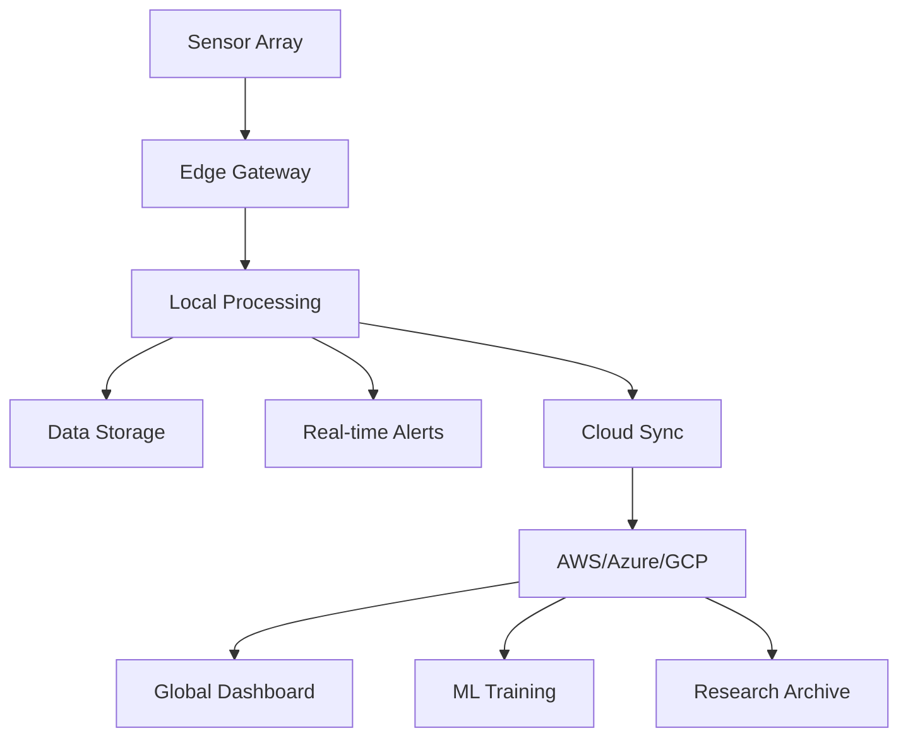

# 🪸 CORAL-CORE Deployment Guide v1.0.0

## Biomineralization Dynamics & Reef Hydro-Acoustic Buffering Framework

**DOI**: 10.5281/zenodo.18913829  
**Repository**: github.com/gitdeeper8/coralcore  
**Web**: coralcore.netlify.app

---

## 📋 Deployment Overview

This guide covers deployment options for CORAL-CORE monitoring stations and data processing pipelines across different environments.

### Deployment Architectures

| Architecture | Use Case | Resources | Scalability |
|-------------|----------|-----------|-------------|
| **Single Station** | Remote reef monitoring | 1 server | Limited |
| **Multi-Station Network** | Regional reef systems | 3-10 servers | Moderate |
| **Cloud-Based** | Global monitoring | Auto-scaling | High |
| **Edge Computing** | Real-time alerts | IoT devices | Distributed |

---

## 🏗️ Architecture Components



---

🔧 Local Deployment (Single Station)

1. Hardware Setup

```bash
# Recommended specifications for field station
# - Intel NUC or Raspberry Pi 4 (8GB)
# - 1TB SSD external storage
# - 4G/LTE modem for connectivity
# - UPS battery backup
# - Solar power system (100W panel + 100Ah battery)
```

2. Install Core Services

```bash
# Update system
sudo apt update && sudo apt upgrade -y

# Install Docker and dependencies
curl -fsSL https://get.docker.com -o get-docker.sh
sudo sh get-docker.sh
sudo usermod -aG docker $USER

# Install Python and tools
sudo apt install -y python3-pip python3-venv git
pip3 install --upgrade pip
```

3. Deploy CORAL-CORE

```bash
# Clone repository
git clone https://github.com/gitdeeper8/coralcore.git
cd coralcore

# Create environment file
cat > .env << 'ENVFILE'
# Station Configuration
STATION_ID=RAS_MOHAMMED_01
STATION_LAT=27.75
STATION_LON=34.23
DEPLOYMENT_DATE=2026-03-08

# Sensor Configuration
SAMI_PORT=/dev/ttyUSB0
AMAR_MOUNT=/mnt/amar
PAM_PORT=/dev/ttyUSB1
ADCP_IP=192.168.1.100
SBE37_PORT=/dev/ttyUSB2

# Data Storage
DATA_DIR=/data/coralcore
BACKUP_DIR=/backup/coralcore
RETENTION_DAYS=365

# Network
SYNC_INTERVAL=3600
CLOUD_ENDPOINT=https://api.coralcore.netlify.app
API_KEY=your_api_key_here

# Alert Configuration
ALERT_EMAIL=monitor@coralcore.org
ALERT_SMS=+1234567890
BLEACHING_THRESHOLD=0.5
WARNING_THRESHOLD=0.7
ENVFILE

# Start services with Docker Compose
docker-compose -f docker-compose.dev.yml up -d
```

4. Configure Data Collection

```bash
# Create data directories
mkdir -p /data/coralcore/{raw,processed,backup}
mkdir -p /data/coralcore/sensors/{sami,amar,pam,adcp,sbe37}

# Set permissions
sudo chown -R $USER:$USER /data/coralcore
chmod 755 /data/coralcore

# Test sensor connections
python scripts/test_sensors.py --all
```

5. Start Monitoring Services

```bash
# Enable systemd services
sudo cp systemd/coralcore-collector.service /etc/systemd/system/
sudo cp systemd/coralcore-processor.service /etc/systemd/system/
sudo cp systemd/coralcore-sync.service /etc/systemd/system/

# Start services
sudo systemctl daemon-reload
sudo systemctl enable coralcore-collector
sudo systemctl enable coralcore-processor
sudo systemctl enable coralcore-sync
sudo systemctl start coralcore-collector
sudo systemctl start coralcore-processor
sudo systemctl start coralcore-sync

# Check status
sudo systemctl status coralcore-collector
sudo systemctl status coralcore-processor
sudo systemctl status coralcore-sync
```

---

☁️ Cloud Deployment (Multi-Station Network)

AWS Deployment

1. Infrastructure as Code (Terraform)

```hcl
# terraform/main.tf
provider "aws" {
  region = "us-east-1"
}

# VPC Configuration
resource "aws_vpc" "coralcore_vpc" {
  cidr_block = "10.0.0.0/16"
  enable_dns_hostnames = true
  tags = {
    Name = "coralcore-vpc"
    Project = "CORAL-CORE"
  }
}

# RDS PostgreSQL for Time-Series Data
resource "aws_db_instance" "coralcore_db" {
  identifier = "coralcore-timeseries"
  engine = "postgres"
  engine_version = "15.3"
  instance_class = "db.r5.xlarge"
  allocated_storage = 1000
  storage_encrypted = true
  db_name = "coralcore"
  username = "coraladmin"
  password = random_password.db_password.result
  
  vpc_security_group_ids = [aws_security_group.rds.id]
  db_subnet_group_name = aws_db_subnet_group.main.name
  
  backup_retention_period = 30
  backup_window = "03:00-04:00"
  maintenance_window = "sun:04:00-sun:05:00"
  
  tags = {
    Name = "coralcore-database"
    Project = "CORAL-CORE"
  }
}

# S3 for Raw Sensor Data
resource "aws_s3_bucket" "coralcore_data" {
  bucket = "coralcore-raw-data-${random_id.bucket_suffix.hex}"
  force_destroy = false
  
  lifecycle_rule {
    id = "archive_old_data"
    enabled = true
    
    transition {
      days = 90
      storage_class = "GLACIER"
    }
    
    expiration {
      days = 3650
    }
  }
  
  tags = {
    Name = "coralcore-raw-data"
    Project = "CORAL-CORE"
  }
}

# ECS Fargate for Processing
resource "aws_ecs_cluster" "coralcore_cluster" {
  name = "coralcore-cluster"
  
  setting {
    name = "containerInsights"
    value = "enabled"
  }
}

resource "aws_ecs_task_definition" "processor" {
  family = "coralcore-processor"
  network_mode = "awsvpc"
  requires_compatibilities = ["FARGATE"]
  cpu = "4096"
  memory = "16384"
  execution_role_arn = aws_iam_role.ecs_execution.arn
  task_role_arn = aws_iam_role.ecs_task.arn
  
  container_definitions = jsonencode([
    {
      name = "processor"
      image = "${aws_ecr_repository.coralcore.repository_url}:latest"
      essential = true
      
      environment = [
        { name = "DB_HOST", value = aws_db_instance.coralcore_db.address },
        { name = "DB_NAME", value = "coralcore" },
        { name = "S3_BUCKET", value = aws_s3_bucket.coralcore_data.bucket }
      ]
      
      secrets = [
        { name = "DB_PASSWORD", valueFrom = aws_secretsmanager_secret.db_password.arn }
      ]
      
      logConfiguration = {
        logDriver = "awslogs"
        options = {
          "awslogs-group" = "/ecs/coralcore-processor"
          "awslogs-region" = "us-east-1"
          "awslogs-stream-prefix" = "ecs"
        }
      }
    }
  ])
}

# API Gateway for Real-time Data
resource "aws_api_gateway_rest_api" "coralcore_api" {
  name = "coralcore-api"
  description = "CORAL-CORE Data API"
  
  endpoint_configuration {
    types = ["REGIONAL"]
  }
}

# Lambda Functions for Processing
resource "aws_lambda_function" "rhi_calculator" {
  filename = "lambda/rhi_calculator.zip"
  function_name = "coralcore-rhi-calculator"
  role = aws_iam_role.lambda_role.arn
  handler = "rhi_calculator.handler"
  runtime = "python3.10"
  timeout = 300
  memory_size = 1024
  
  environment {
    variables = {
      DB_HOST = aws_db_instance.coralcore_db.address
      DB_NAME = "coralcore"
    }
  }
}

# CloudWatch Alarms
resource "aws_cloudwatch_metric_alarm" "bleaching_alert" {
  alarm_name = "coralcore-bleaching-alert"
  comparison_operator = "LessThanThreshold"
  evaluation_periods = 2
  metric_name = "RHI"
  namespace = "CORAL-CORE"
  period = 3600
  statistic = "Average"
  threshold = 0.5
  alarm_description = "Alert when RHI drops below 0.5 (bleaching imminent)"
  alarm_actions = [aws_sns_topic.alerts.arn]
  
  dimensions = {
    StationID = "RAS_MOHAMMED_01"
  }
}
```

2. Deploy with Terraform

```bash
# Initialize Terraform
cd terraform
terraform init

# Plan deployment
terraform plan -var-file=environments/production.tfvars

# Apply deployment
terraform apply -var-file=environments/production.tfvars -auto-approve

# Get outputs
terraform output
```

Google Cloud Platform Deployment

```bash
# Create GCP project
gcloud projects create coralcore-${PROJECT_ID} --name="CORAL-CORE"

# Enable required services
gcloud services enable compute.googleapis.com
gcloud services enable container.googleapis.com
gcloud services enable bigquery.googleapis.com
gcloud services enable aiplatform.googleapis.com

# Deploy to Google Kubernetes Engine
gcloud container clusters create coralcore-cluster \
  --num-nodes=3 \
  --machine-type=e2-standard-8 \
  --zone=us-central1-a

# Get credentials
gcloud container clusters get-credentials coralcore-cluster

# Deploy with Helm
helm install coralcore ./helm/coralcore \
  --set environment=production \
  --set database.type=CloudSQL \
  --set storage.type=GCS
```

Azure Deployment

```bash
# Login to Azure
az login

# Create resource group
az group create --name coralcore-rg --location eastus

# Create AKS cluster
az aks create \
  --resource-group coralcore-rg \
  --name coralcore-aks \
  --node-count 3 \
  --node-vm-size Standard_D8s_v3 \
  --enable-addons monitoring

# Deploy with Azure DevOps
# See .azure-pipelines/deploy.yml for CI/CD configuration
```

---

🌐 Netlify Deployment (Web Dashboard)

1. Configure Netlify

```yaml
# netlify.toml
[build]
  command = "python web/build_static.py"
  publish = "web/build"
  functions = "netlify/functions"

[build.environment]
  PYTHON_VERSION = "3.10"

[dev]
  command = "python web/app.py"
  port = 5000
  publish = "web/build"

[[redirects]]
  from = "/api/*"
  to = "/.netlify/functions/:splat"
  status = 200

[[headers]]
  for = "/*"
  [headers.values]
    X-Frame-Options = "DENY"
    X-XSS-Protection = "1; mode=block"
    Content-Security-Policy = "default-src 'self'"

[functions]
  directory = "netlify/functions"
  node_bundler = "esbuild"
```

2. Netlify Functions for API

```python
# netlify/functions/rhi.py
import json
import boto3
import os
from datetime import datetime, timedelta

def handler(event, context):
    """Netlify function to fetch RHI data"""
    try:
        # Parse query parameters
        params = event.get('queryStringParameters', {})
        station_id = params.get('station', 'RAS_MOHAMMED_01')
        days = int(params.get('days', 30))
        
        # Calculate date range
        end_date = datetime.utcnow()
        start_date = end_date - timedelta(days=days)
        
        # Query database (example with AWS Timestream)
        query = f"""
        SELECT time, measure_value::double as rhi
        FROM coralcore.rhi_timeseries
        WHERE station_id = '{station_id}'
          AND time BETWEEN '{start_date.isoformat()}' AND '{end_date.isoformat()}'
        ORDER BY time DESC
        """
        
        # Execute query (implementation depends on your DB)
        # results = execute_timestream_query(query)
        
        # Mock data for example
        results = [
            {"time": (end_date - timedelta(days=i)).isoformat(), 
             "rhi": 0.75 + 0.05 * (i % 5)} 
            for i in range(days)
        ]
        
        return {
            "statusCode": 200,
            "headers": {
                "Content-Type": "application/json",
                "Access-Control-Allow-Origin": "*"
            },
            "body": json.dumps({
                "station": station_id,
                "days": days,
                "data": results,
                "current_rhi": results[0]["rhi"] if results else None,
                "status": "healthy" if results and results[0]["rhi"] > 0.5 else "warning"
            })
        }
        
    except Exception as e:
        return {
            "statusCode": 500,
            "body": json.dumps({"error": str(e)})
        }
```

3. Deploy to Netlify

```bash
# Install Netlify CLI
npm install -g netlify-cli

# Build static files
python web/build_static.py

# Deploy to Netlify
netlify deploy --prod --dir=web/build

# Or use continuous deployment from GitHub
# 1. Push to GitHub: git push origin main
# 2. Connect repository in Netlify dashboard
# 3. Auto-deploys on every push
```

---

📡 Edge Computing Deployment

Raspberry Pi Field Station

```bash
# Install Raspberry Pi OS Lite
# Download from: https://www.raspberrypi.com/software/

# Initial setup
sudo raspi-config
# Enable: SSH, I2C, SPI, Serial

# Install dependencies
sudo apt update
sudo apt install -y python3-pip python3-venv git \
  libatlas-base-dev libhdf5-dev libopenblas-dev

# Install Docker
curl -fsSL https://get.docker.com -o get-docker.sh
sudo sh get-docker.sh
sudo usermod -aG docker pi

# Clone and configure
git clone https://github.com/gitdeeper8/coralcore.git
cd coralcore

# Optimize for Raspberry Pi
cat > config/edge.yaml << 'YAML'
# Edge Computing Configuration
mode: "edge"
processing:
  batch_size: 100
  max_workers: 2
  use_gpu: false
  precision: "float16"
storage:
  local_path: "/mnt/data/coralcore"
  max_size_gb: 100
  rotation_days: 30
network:
  sync_interval: 3600
  compress_data: true
  use_4g: true
alerts:
  local: true
  cloud: true
  threshold_rhi: 0.5
YAML

# Start edge services
python scripts/edge_controller.py --config config/edge.yaml
```

Edge ML Inference

```python
# scripts/edge_inference.py
import numpy as np
import tensorflow as tf
from coralcore.physics import RHI_Calculator

class EdgeInference:
    """Optimized inference for edge devices"""
    
    def __init__(self, model_path):
        # Load quantized TFLite model
        self.interpreter = tf.lite.Interpreter(model_path=model_path)
        self.interpreter.allocate_tensors()
        
        # Get input/output details
        self.input_details = self.interpreter.get_input_details()
        self.output_details = self.interpreter.get_output_details()
        
        # Initialize RHI calculator
        self.rhi_calc = RHI_Calculator()
    
    def predict_bleaching(self, sensor_data):
        """Run edge inference for bleaching prediction"""
        # Prepare input tensor
        input_data = self.preprocess(sensor_data)
        self.interpreter.set_tensor(
            self.input_details[0]['index'], 
            input_data
        )
        
        # Run inference
        self.interpreter.invoke()
        
        # Get output
        output = self.interpreter.get_tensor(
            self.output_details[0]['index']
        )
        
        # Calculate RHI
        rhi = self.rhi_calc.compute(sensor_data)
        
        return {
            'bleaching_probability': float(output[0]),
            'rhi': float(rhi),
            'alert': rhi < 0.5,
            'timestamp': sensor_data['timestamp']
        }
    
    def preprocess(self, data):
        """Optimize data for edge inference"""
        # Extract 8 parameters
        params = np.array([
            data['g_ca'], data['e_diss'], data['phi_ps'],
            data['rho_skel'], data['delta_ph'], data['s_reef'],
            data['k_s'], data['t_thr']
        ], dtype=np.float32)
        
        # Normalize
        params = (params - self.mean) / self.std
        
        # Add batch dimension
        return params.reshape(1, -1)
```

---

🔄 Data Synchronization

Multi-Station Sync Configuration

```yaml
# config/sync.yaml
sync:
  strategy: "hybrid"  # real-time, batch, or hybrid
  protocols:
    primary: "mqtt"
    fallback: "http"
    
  mqtt:
    broker: "mqtt.coralcore.netlify.app"
    port: 8883
    use_tls: true
    topics:
      - "coralcore/+/sensors/+"
      - "coralcore/+/alerts/+"
    
  http:
    endpoint: "https://api.coralcore.netlify.app/sync"
    batch_size: 1000
    compression: "gzip"
    
  offline:
    storage: "sqlite"
    path: "/data/coralcore/offline.db"
    max_size: "10GB"
    
  conflict_resolution:
    strategy: "last_write_wins"
    vector_clocks: true
```

Sync Service Implementation

```python
# scripts/sync_service.py
import asyncio
import aiomqtt
import aiohttp
import sqlite3
from datetime import datetime
from typing import Dict, List
import json
import zlib

class DataSyncService:
    """Handles data synchronization between stations and cloud"""
    
    def __init__(self, config_path: str):
        with open(config_path) as f:
            self.config = yaml.safe_load(f)
        
        self.local_db = sqlite3.connect(
            self.config['offline']['path'],
            check_same_thread=False
        )
        self.init_local_db()
        
        self.sync_queue = asyncio.Queue()
        self.sync_in_progress = False
    
    def init_local_db(self):
        """Initialize local SQLite database"""
        self.local_db.execute('''
            CREATE TABLE IF NOT EXISTS sensor_data (
                id INTEGER PRIMARY KEY AUTOINCREMENT,
                station_id TEXT,
                timestamp DATETIME,
                parameter TEXT,
                value REAL,
                synced BOOLEAN DEFAULT FALSE,
                created_at DATETIME DEFAULT CURRENT_TIMESTAMP
            )
        ''')
        
        self.local_db.execute('''
            CREATE INDEX IF NOT EXISTS idx_sync 
            ON sensor_data(synced, timestamp)
        ''')
        
        self.local_db.commit()
    
    async def mqtt_sync(self):
        """Real-time sync via MQTT"""
        async with aiomqtt.Client(
            self.config['mqtt']['broker'],
            port=self.config['mqtt']['port'],
            tls_params=aiomqtt.TLSParameters()
        ) as client:
            
            # Subscribe to all topics
            for topic in self.config['mqtt']['topics']:
                await client.subscribe(topic)
            
            async for message in client.messages:
                # Process incoming message
                data = json.loads(message.payload)
                await self.process_sensor_data(data)
                
                # Acknowledge receipt
                await client.publish(
                    f"{message.topic}/ack",
                    json.dumps({"received": datetime.utcnow().isoformat()})
                )
    
    async def batch_sync(self):
        """Batch sync via HTTP"""
        while True:
            await asyncio.sleep(self.config['http'].get('interval', 3600))
            
            if self.sync_in_progress:
                continue
            
            try:
                # Get unsynced data
                cursor = self.local_db.execute('''
                    SELECT id, station_id, timestamp, parameter, value
                    FROM sensor_data
                    WHERE synced = FALSE
                    ORDER BY timestamp
                    LIMIT ?
                ''', (self.config['http']['batch_size'],))
                
                rows = cursor.fetchall()
                if not rows:
                    continue
                
                # Prepare batch
                batch = {
                    "station_id": rows[0][1],  # Assuming same station
                    "data": [
                        {
                            "timestamp": row[2],
                            "parameter": row[3],
                            "value": row[4]
                        }
                        for row in rows
                    ],
                    "compressed": False
                }
                
                # Compress if enabled
                if self.config['http'].get('compression') == 'gzip':
                    batch['data'] = zlib.compress(
                        json.dumps(batch['data']).encode()
                    ).hex()
                    batch['compressed'] = True
                
                # Send to cloud
                async with aiohttp.ClientSession() as session:
                    async with session.post(
                        self.config['http']['endpoint'],
                        json=batch,
                        headers={"X-API-Key": self.config['api_key']}
                    ) as resp:
                        if resp.status == 200:
                            # Mark as synced
                            ids = [row[0] for row in rows]
                            self.local_db.executemany(
                                'UPDATE sensor_data SET synced = TRUE WHERE id = ?',
                                [(id,) for id in ids]
                            )
                            self.local_db.commit()
                            
            except Exception as e:
                print(f"Sync error: {e}")
                self.sync_in_progress = False
    
    async def process_sensor_data(self, data: Dict):
        """Process incoming sensor data"""
        # Store locally
        cursor = self.local_db.execute('''
            INSERT INTO sensor_data (station_id, timestamp, parameter, value)
            VALUES (?, ?, ?, ?)
        ''', (
            data['station_id'],
            data['timestamp'],
            data['parameter'],
            data['value']
        ))
        self.local_db.commit()
        
        # Trigger real-time processing
        if data['parameter'] == 'rhi' and data['value'] < 0.5:
            await self.send_alert(data)
    
    async def send_alert(self, data: Dict):
        """Send alert for critical values"""
        # Implementation depends on alerting system
        pass
    
    async def run(self):
        """Run sync service"""
        await asyncio.gather(
            self.mqtt_sync(),
            self.batch_sync()
        )

if __name__ == "__main__":
    service = DataSyncService("config/sync.yaml")
    asyncio.run(service.run())
```

---

📊 Monitoring & Alerting

Prometheus Configuration

```yaml
# prometheus/prometheus.yml
global:
  scrape_interval: 15s
  evaluation_interval: 15s

alerting:
  alertmanagers:
    - static_configs:
        - targets: ['alertmanager:9093']

rule_files:
  - "alerts.yml"

scrape_configs:
  - job_name: 'coralcore-stations'
    static_configs:
      - targets:
        - 'ras-mohammed:9100'
        - 'ningaloo:9100'
        - 'lizard-island:9100'
    metrics_path: '/metrics'
    scrape_interval: 30s

  - job_name: 'coralcore-processors'
    kubernetes_sd_configs:
      - role: pod
    relabel_configs:
      - source_labels: [__meta_kubernetes_pod_label_app]
        regex: coralcore-processor
        action: keep
```

Alert Rules

```yaml
# prometheus/alerts.yml
groups:
  - name: coralcore_alerts
    rules:
      - alert: BleachingImminent
        expr: coralcore_rhi < 0.5
        for: 1h
        labels:
          severity: critical
        annotations:
          summary: "Bleaching imminent at {{ $labels.station }}"
          description: "RHI has dropped below 0.5 for 1 hour"
          
      - alert: ThermalStress
        expr: coralcore_temperature > coralcore_t_thr
        for: 24h
        labels:
          severity: warning
        annotations:
          summary: "Thermal stress at {{ $labels.station }}"
          
      - alert: LowCalcification
        expr: coralcore_g_ca < 0.5
        for: 7d
        labels:
          severity: warning
        annotations:
          summary: "Low calcification rate detected"
```

Grafana Dashboard

```json
{
  "dashboard": {
    "title": "CORAL-CORE Reef Health Monitor",
    "panels": [
      {
        "title": "Reef Health Index (RHI)",
        "type": "graph",
        "targets": [
          {
            "expr": "coralcore_rhi{station=\"$station\"}",
            "legendFormat": "RHI"
          }
        ],
        "thresholds": [
          { "value": 0.5, "color": "red" },
          { "value": 0.7, "color": "yellow" },
          { "value": 0.8, "color": "green" }
        ]
      },
      {
        "title": "8-Parameter Timeseries",
        "type": "table",
        "targets": [
          {
            "expr": "coralcore_parameters{station=\"$station\"}",
            "format": "table"
          }
        ]
      }
    ]
  }
}
```

---

🔒 Security Configuration

SSL/TLS Setup

```bash
# Generate certificates
openssl req -x509 -newkey rsa:4096 \
  -keyout key.pem -out cert.pem \
  -days 365 -nodes \
  -subj "/CN=coralcore.netlify.app"

# Configure nginx
cat > /etc/nginx/sites-available/coralcore << 'NGINX'
server {
    listen 443 ssl;
    server_name api.coralcore.netlify.app;
    
    ssl_certificate /etc/ssl/certs/coralcore/cert.pem;
    ssl_certificate_key /etc/ssl/private/coralcore/key.pem;
    
    location / {
        proxy_pass http://localhost:8000;
        proxy_set_header Host $host;
        proxy_set_header X-Real-IP $remote_addr;
    }
}
NGINX
```

API Authentication

```python
# auth/jwt_auth.py
import jwt
from datetime import datetime, timedelta
from functools import wraps
from flask import request, jsonify

class JWTAuth:
    def __init__(self, secret_key):
        self.secret_key = secret_key
        self.algorithm = "HS256"
    
    def generate_token(self, user_id, role="viewer"):
        payload = {
            "user_id": user_id,
            "role": role,
            "exp": datetime.utcnow() + timedelta(days=1),
            "iat": datetime.utcnow()
        }
        return jwt.encode(payload, self.secret_key, algorithm=self.algorithm)
    
    def verify_token(self, token):
        try:
            payload = jwt.decode(
                token, 
                self.secret_key, 
                algorithms=[self.algorithm]
            )
            return payload
        except jwt.ExpiredSignatureError:
            return None
        except jwt.InvalidTokenError:
            return None
    
    def require_auth(self, f):
        @wraps(f)
        def decorated(*args, **kwargs):
            token = request.headers.get('Authorization', '').replace('Bearer ', '')
            
            if not token:
                return jsonify({"error": "No token provided"}), 401
            
            payload = self.verify_token(token)
            if not payload:
                return jsonify({"error": "Invalid token"}), 401
            
            request.user = payload
            return f(*args, **kwargs)
        return decorated
```

---

📈 Performance Optimization

Database Indexing

```sql
-- PostgreSQL optimization
CREATE INDEX idx_sensor_data_time ON sensor_data(timestamp DESC);
CREATE INDEX idx_sensor_data_station_time ON sensor_data(station_id, timestamp DESC);
CREATE INDEX idx_rhi_composite ON rhi_values(station_id, timestamp, value);

-- TimescaleDB hypertable
SELECT create_hypertable('sensor_data', 'timestamp');
SELECT add_retention_policy('sensor_data', INTERVAL '5 years');
```

Caching Strategy

```python
# cache/redis_cache.py
import redis
import json
from functools import wraps

class CoralCache:
    def __init__(self, host='localhost', port=6379, db=0):
        self.redis = redis.Redis(
            host=host, port=port, db=db,
            decode_responses=True
        )
        self.default_ttl = 3600  # 1 hour
    
    def cached(self, ttl=None):
        def decorator(f):
            @wraps(f)
            def wrapper(*args, **kwargs):
                # Create cache key from function name and arguments
                key = f"{f.__name__}:{hash(frozenset(kwargs.items()))}"
                
                # Try to get from cache
                cached = self.redis.get(key)
                if cached:
                    return json.loads(cached)
                
                # Compute and cache
                result = f(*args, **kwargs)
                self.redis.setex(
                    key, 
                    ttl or self.default_ttl,
                    json.dumps(result)
                )
                return result
            return wrapper
        return decorator

cache = CoralCache()

@cache.cached(ttl=300)
def get_rhi_timeseries(station_id, days=30):
    # Expensive database query
    pass
```

---

📋 Deployment Checklist

Pre-Deployment

· Hardware requirements verified
· Sensor connections tested
· Network connectivity confirmed
· Power backup configured
· Data storage sized appropriately
· Security certificates generated
· API keys created

Deployment Steps

· Clone repository
· Configure environment variables
· Install dependencies
· Initialize database
· Start core services
· Configure monitoring
· Set up alerts
· Test data flow

Post-Deployment

· Verify data collection
· Test alert system
· Validate RHI calculations
· Check backup system
· Document configuration
· Train operators

---

🆘 Troubleshooting

Common Deployment Issues

Issue Solution
Sensors not connecting Check USB/serial permissions Verify baud rates Test with python scripts/test_sensors.py
Database connection failed Verify credentials in .env Check network firewall Test with python scripts/test_db.py
Docker container won't start Check logs: docker-compose logs Verify port availability Check volume mounts
Cloud sync failing Check API endpoint URL Verify API key Check network connectivity
High memory usage Adjust batch sizes in config Enable data compression Scale horizontally
Slow RHI computation Enable GPU acceleration Optimize database queries Use caching layer

Emergency Procedures

```bash
# Emergency stop all services
docker-compose down

# Backup critical data
tar -czf /backup/coralcore-emergency-$(date +%Y%m%d).tar.gz /data/coralcore

# Restart with clean state
docker-compose up -d --force-recreate

# Restore from backup
tar -xzf /backup/coralcore-emergency-*.tar.gz -C /
```

---

📚 References

· CORAL-CORE Research Paper: DOI: 10.5281/zenodo.18913829
· API Documentation: https://coralcore.netlify.app/api
· Deployment Videos: https://coralcore.netlify.app/tutorials
· Community Forum: https://github.com/gitdeeper8/coralcore/discussions

---

For deployment support: gitdeeper@gmail.com · ORCID: 0009-0003-8903-0029
DOI: 10.5281/zenodo.18913829 · Web: coralcore.netlify.app
